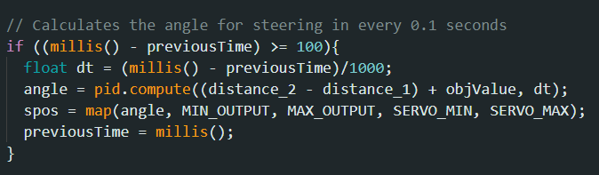
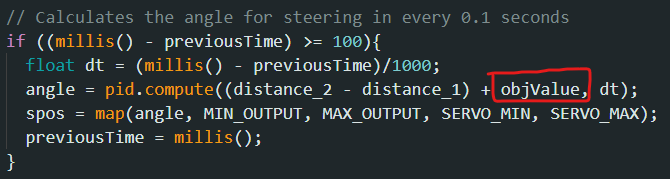

# WRO2024-TechZone
This is the official repository of the team "Tech Zone" for World Robot Olympiad 2024 in the Future Engineer category. At this repository you can see all of our Codes, Components that were used, Team Photo, Robot's Photos etc.
There are two files named `main.ino` and `Car_PID.h`

# List of Components Used
- Handmade chassis with thin acrylite plastic
- ESP-8266 as microcontroller
- Husky Lens as camera
- Two Sonar Sensors for distance calculation
- MPU6050 Gyroscope to count laps
- MG995 Servo for steering
- 2x3.7 volt = 7.4 volt battery pack
- dc to dc buck converter (XL6009R1)
- l298n Motor Driver

# First Round
- Sonar Sensors are used for calculating it's distance from the walls.
- The car tries to keep itself in the center of the track with PID.
- Gyroscope is used to count laps. Whenever the car rotates around 1080 degrees (3 laps), the car will stop.

# Second Round
- Same as first round.
- If the husky lens detects green or red color it will get its width and calculate an estimated distance.
- If the husky detects Red then the PID Controller track changes to slightly in the right. So car will go right.
- If the huskt detects Green then the PID Controller track changes to slighly in the left.

# Code

## Car_PID.h
This file contains the mechanism of PID Controller for the car to keep in track.

## main.ino
This is the main file that contains all the code of first and second round.

At first the car calculates the distances of walls with two sonars on both side. Then it sends the error to the PID class and calculates it's angle with it. 

In every 0.1 seconds it will send the `error (distance_2 - distance_1)` to the PID class. So it will try to maintain a fixed path in the center of the track.

There is another variable here named `objValue` that basically helps for obstacle avoidance. `objValue` will differ based on the obstacle husky lens sees. So the final output of PID will go slightly left or right based on the obstacle.

[Camera](./readme_photos/1.png)

This is the code where we change `objValue` based on the obstacle's color. We can estimate a distance of the obstacle with a constant divided by it's width. This part finds the minimum distance of the available obstacles, thus it changes it's path based on the closest one.
